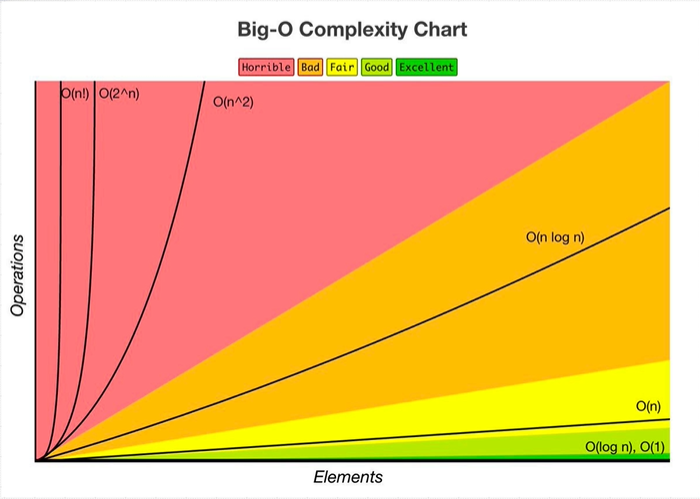

# Data Structures and Algorithms

[Data Structures and Algorithms Diagram](https://coggle.it/diagram/W5E5tqYlrXvFJPsq/t/master-the-interview-click-here-for-course-link)

## **Big O**

To see the Big O examples run `bun TS/BigO/index.ts`

### Big Os (Time Complexity)

- **O(1)**: Constant – no loops
- **O(log N)**: Logarithmic – usually searching algorithms have log n if they are sorted (Binary Search)
- **O(n)**: Linear – for loops, while loops through n items
- **O(n log(n))**: Log Linear – usually sorting operations
- **O(n^2)**: Quadratic – every element in a collection needs to be compared to ever other element. Two nested loops
- **O(2^n)**: Exponential – recursive algorithms that solves a problem of size N
- **O(n!)**: Factorial – you are adding a loop for every element

- **Iterating through half a collection is still O(n)**
- **Two separate collections: O(a \* b)**

[](https://www.bigocheatsheet.com/)

<a style="color:gray; font-size: 0.5rem;" href="https://www.bigocheatsheet.com/" target="_blank">Click in the image to see more</a>

### Rule Book

1. Always worst Case
2. Remove Constants => If i have O(2n + 100) at the end is same as O(n)
3. Different inputs => Different variables or args. A & B variables nested would be O(a+b)
4. Drop non Dominant terms

### Big Os (Space Complexity)

**Heap**: Variables, Values
**Stack**: Keep Track of functions

#### What Causes Space Complexity?

- Variables
- Data Structures
- Function Call
- Allocations

The Space Complexity follows the same pattern as Time. For example On would be a function that adds data in memory as the number of input grows.

```javascript
//O(n) => bigger n, bigger arr
function createArray(input) {
  let arr = [];
  for (let i = 0; i < input.length; i++) {
    arr.push(i);
  }
  return arr;
}
```

## **Good Code**

["Premature optimization can be the root of all evil"](https://stackify.com/premature-optimization-evil/)

- Readability: DRY, Clear Naming, avoid "Cleverness", self-documenting, consistent
- Scalability:
  - Design: Modular, Separation of Concern, extensible, SOLID principles
  - Speed: Time Complexity
  - Memory: Space Complexity
- Maintainability: Version Control, Clear Deendency Management, Well organized (folder structure)
- Reliability: Error Handling, Input validations, Defensive program Techniques, Tests (TDD, Unit, Integration...)

## Tips about better Code

- Hash Tables are usually the best idea to improve Time Compexity
- If it is a sorted array, Divide and Conquer is a good idea (Binary Tree)
- Sometimes is a good Idea to sort the input

## Solve a Coding Problem Sep by Step

This steps will ensure the proper approach for any Interview Question

1. Understand:
   - Write down the key points
   - Double check (what are inputs, outputs...)
   - Know what it is the most impotant value of the problem
   - Ask as many questions as I need
2. Prepare:
   - Start by brute force approach. **First make it work** Just speaking and no coding.
   - Evaluate the approach (Big O, Constraints, bottlenecks...)
   - Write Down the steps I will follow (modularize from beginning)
3. Execute:
   - Start Writting the code
   - Think about error handling
   - Name the variables properly
4. Testing:
   - Test the code
   - Tell where Could I improve the code
   - Answer possible questions

# Data structures

It determines the way we organize a collection of values. Each Data structure is specialized for different purposes.

[It is important to understand how the computers allocate the memory and stores Data](https://statmath.wu.ac.at/courses/data-analysis/itdtHTML/node55.html)

The most used **Data structures** are:

| Data Structure   | Insertion                                   | Deletion                                    | Traversal | Searching                      | Sorting    |
| ---------------- | ------------------------------------------- | ------------------------------------------- | --------- | ------------------------------ | ---------- |
| Arrays           | **O(1)** at end, O(n) at arbitrary position | **O(1)** at end, O(n) at arbitrary position | O(n)      | O(n) unsorted, O(log n) sorted | O(n log n) |
| Stacks           | **O(1)**                                    | **O(1)**                                    | O(n)      | O(n)                           | N/A        |
| Queues           | **O(1)**                                    | **O(1)**                                    | O(n)      | O(n)                           | N/A        |
| Linked Lists     | **O(1)**                                    | **O(1)** if position known, otherwise O(n)  | O(n)      | O(n)                           | O(n log n) |
| Trees (balanced) | O(log n)                                    | O(log n)                                    | O(n)      | O(log n)                       | O(n log n) |
| Tries            | O(k), where k is key length                 | O(k), where k is key length                 | O(n)      | O(k), where k is key length    | O(n)       |
| Graphs           | **O(1)** for vertex, **O(1)** for edge      | O(V+E) for vertex, O(E) for edge            | O(V+E)    | O(V+E)                         | N/A        |
| Hash Tables      | **O(1)** average, O(n) worst                | **O(1)** average, O(n) worst                | O(n)      | **O(1)** average, O(n) worst   | N/A        |

**Note:**

- "N/A" indicates that the operation is not applicable for that data structure.

The most used Algorithms are:

- Sorting
- Dynamic PRogramming
- BFS + DFS (Search)
- Recursion

## Arrays

[Array Implementation](TS/DataStructures/arrays.ts)

They are stored in contiguos memory making them to have a small footprint. There are 2 types of arrays

1. Static: they are specific in size
1. Dynamic: the size changes. In background copies the array and allocates the array with the new size in another block of memory.

**How a Dynamic array is adapted each time we add new elements**:

```cpp
// Create STATIC array
int a[5] = {1, 2, 3, 4, 5};
// Change size
int newSize = 6;
int* newArray = new int[newSize];

// Copy existing elements
for (int i = 0; i < 5; i++) {
    newArray[i] = a[i];
}

// Add new element
newArray[5] = 6;

// Don't forget to delete the dynamically allocated array when done
delete[] newArray;
```

**Good for:** Lockup, push/pop, Sorting

**Not good for:** Inserts, Deletion, If they are static they have fixed size

**Performance:**

- pop() => O(1)
- push() => Normally O(1), but if it has to allocate it in another block of memory it becomes O(n)
- unshift() => O(n)
- splice() => O(n)

<a style="font-size: 0.6rem; font-weight: bold;" href="TS/DataStructures/classes-explanation.ts">\* Note about classes </a>

<p style="font-size: 0.6rem; font-weight: bold;">* Strings can be treated as Arrays</p>

## Hash Tables (Objects in JS)

[Hash Table Implementation](TS/DataStructures/hash-tables.ts)
Hash tables are data structures that store key-value pairs, allowing for efficient retrieval and insertion of data. In JavaScript, objects essentially function as hash tables.

**How Hash Tables Work**

- Hashing Function: When you create a key-value pair in a JavaScript object, the key is passed through a hashing function. This function converts the key into a numeric hash code.
- Array Index: The hash code is then used to determine the index in an underlying array where the value will be stored.
- Storage: The value is stored at this calculated index in the array.
- Retrieval: When you access a value using its key, the same hashing process occurs to find the correct array index.

**Collision Handling**
Sometimes, different keys may produce the same hash code, leading to collisions. JavaScript engines handle this internally, often using techniques like:

- Chaining: Multiple values at the same index are stored in a linked list.
- Open Addressing: If a collision occurs, the engine looks for the next available slot.

**In JavaScript, this process is abstracted away, but conceptually:**

```javascript
let obj = {};

// When you do this:
obj["name"] = "Pepe";

// JavaScript internally does something like:
let hashCode = hashFunction("name");
let index = hashCode % arraySize;
internalArray[index] = "Pepe";
```

**Good for:** Most of the cases is O(1)
**Not good for:** When It handles collisions It becomes O(n) because it stores the data using a Linked List in the memory address. They are unordered. Slow Keys interation O(n²).

**Performance:**

- Insert => O(1)
- Lookup => O(1)
- Delete => O(1)
- Search => O(1)

**Javascript has:**

Map => It can use any data type as a _key_ and it mantains _Insertion Order_

Sets => It only stores Keys. No values.

## Linked List

[Singly Linked List Implementation](TS/DataStructures/single-linked-list.ts)

[Doubly Linked List Implementation](TS/DataStructures/double-linked-list.ts)

A set of structured data organized with nodes that store data and have connections to other nodes.

- <u>Singly Linked List:</u> Each node contains data and a pointer to the next node.
- <u>Doubly Linked List:</u> Each node contains data and two pointers - one to the next node and one to the previous node.
- <u>Circular Linked List:</u> A variation where the last node points back to the first node, creating a circle

<p style="font-size: 0.6rem; font-weight: bold;">*The Singly Linked List uses less memory, but it can be traversed only from Head to Tail</p>

**Components**

- Head: The first node in the list.
- Tail: The last node in the list (points to null in a singly linked list).
- Nodes: Each element in the list, containing data and pointer(s).

<p style="font-size: 0.6rem; font-weight: bold;">*The tail points to <u>null</u></p>

**Good for:** Insertion and Deletion. Dynamic size.
**Not good for:** Non Contiguos memory. Slow Lookup.

**Performance:**

- Prepend => O(1)
- Append => O(1)
- Lookup => O(n)
- Insert => O(n)
- Delete => O(n)

## Stacks and Queues

[Stack Implementation](TS/DataStructures/stack.ts)

[Queue Implementation](TS/DataStructures/queue.ts)

Both stacks and queues are linear data structures that follow specific orders for adding and removing elements.

<u>**Stack:**</u> Follows Last-In-First-Out (LIFO) principle. The last element added is the first one to be removed.

<u>The implementation can be:</u>

- Array: Use less memory, but resize can take O(n). It is more cache Friendly because of spatial locality.
- Linked lists: use more Memory, but if they need to grow and shrink frequently dont need resizing operations.

<u>The Parts are:</u>

- Top: The most recently added element.
- Push: Operation to add an element to the top.
- Pop: Operation to remove the top element.

<u>**Queue:**</u> Follows First-In-First-Out (FIFO) principle. The first element added is the first one to be removed.

<u>The implementation can be:</u>

- Linked lists: The operations will be in the Head, and will be always O(1). An implementation with arrays would require reindexing after each operation.

<u>The Parts are:</u>

- Front: The first element in the queue (to be removed next).
- Rear: The last element in the queue (most recently added).
- Enqueue: Operation to add an element to the rear.
- Dequeue: Operation to remove an element from the front.

<p style="font-size: 0.6rem; font-weight: bold;">*Stacks are often compared to a stack of plates, while queues are like a line of people waiting.</p>

**Good for:** <u>Stack:</u> Function call management, undo mechanisms, expression evaluation.<u>Queue:</u> Task scheduling, breadth-first search, buffer for data streams.

**Not good for:** Random access, searching for a specific element.

**Performance:**

<u>Stack:</u>

- Lookup => O(n) <span style="font-size: 0.6rem; color: gray;">This operation is not usual</span>
- Push => O(1)
- Pop => O(1)
- Peek (view top element) => O(1)

<u>Queue:</u>

- Lookup => O(n) <span style="font-size: 0.6rem; color: gray;">This operation is not usual</span>
- Enqueue => O(1)
- Dequeue => O(1)
- Peek (view front element) => O(1)

<p style="font-size: 0.6rem; font-weight: bold;">*These time complexities assume an efficient implementation. Array-based implementations might have O(n) for some operations if resizing is needed.</p>

## Trees

[Binary Search Tree Implementation](TS/DataStructures/binary-tree.ts)
[Binary Search Tree Visual Example](https://visualgo.net/en/bst)

Hierarchical data structure composed of nodes. Each node has a value and can have a maximum of 2 child nodes.

A Linked list is some kind of tree, but whit only one lineal path.

The binary search Tree has some rules:

- All child nodes to the right of the node must be higher.
- Each node can have max. 2 children.

<u>Perfect Binary tree:</u> All its Nodes have 2 or 0 children. They are more eficient. Each level on the tree doubles its nodes. The number of nodes of the last leves is equal as the rest of the nodes of the tree +1.

<u>Full Binary Tree:</u> All its nodes have either 0 or 2 children (Never 1)

<u>There are also other kind of Binary Search Trees:</u>

<a href="https://www.cs.usfca.edu/~galles/visualization/AVLtree.html">AVL Tree:</a> Self-balancing binary search tree (BST). It maintains a balance factor for each node, which is the difference between the heights of the left and right subtrees. This balance factor must be -1, 0, or +1 for the tree to remain balanced

<a href="https://www.cs.usfca.edu/~galles/visualization/RedBlack.html">Red Black Tree:</a> Self-balancing binary search tree (BST). Each node in a Red-Black Tree has an additional attribute: a color, which can be either red or black.

**Components**

- Root: Topmost Node. It serves as the starting point.
- Parent: Is a node which has child nodes.
- Child: Nodes that descend from a parent.
- Siblings: Child nodes from the same parent.
- Leaf: Child that has no more Child.

**Good for:** In Balance Search Tree: Searching and Lookup are O(log n). It is ordered and has flexible size.
**Not good for:** When it is unbalance operations take O(n). It has no O(1) operations.

**Performance:**

If balanced:

- Search => O(log n)
- Insert => O(log n)
- Delete => O(log n)

If Unbalanced:

- Search => O(n)
- Insert => O(n)
- Delete => O(n)

**Other kind of Trees**

<u><a href="https://visualgo.net/en/heap?slide=1">Binary Heap:</a></u> The parent Nodes are ALWAYS bigger / smaller than any of its children

The insertion goes from left to right. It balances and keeps always the value relations. It can be implemented with arrays because it always keeps the order of insertions.

**Good for:** Doing comparative Operations. Priority queues (The order is based in priority instead of order of insertion). Flexible Size.

**Not good for:** Slow Lookup.

**Performance:**

- Lookup => O(n) because it is less ordered als BST.
- Insert => O(log n)
- Delete => O(log n)

<p style="font-size: 0.6rem; font-weight: bold;">* It has no relation with the memory Heap of the Javascript runtime Engine</p>

<u><a href="#">Trie:</a></u> is a specialized tree structure used primarily for storing strings or sequences. It consists of nodes that represent common prefixes of strings. The root node is typically empty.

**Good For:** Tries are particularly useful for autocomplete features, spell checking, and implementing dictionaries where prefix matching is required.

**Performance:**

- Lookup => O(m) where m is the length of the string being searched
- Insert => O(m)
- Delete => O(m)

## Graphs

[Graph Implementation](TS/DataStructures/graph.ts)
[Graph Example](https://visualgo.net/en/graphds?slide=1)

A graph is a set of vertices (nodes) connected by edges. It's a versatile data structure that can represent various relationships. Trees and linked lists are special types of graphs.

**Types of Graphs:**

<u>Directed Graphs:</u> Edges have a specific direction.
<u>Undirected Graphs:</u> Edges have no direction.

<u>Weighted Graphs:</u> Edges carry additional information (weights).
<u>Unweighted Graphs:</u> Edges don't have associated weights.

<u>Cyclic Graphs:</u> Contain at least one cycle.
<u>Acyclic Graphs:</u> Have no cycles.

**There are several ways to repsresent Graphs**

```
   2-----0
  / \
 1---3
```

<u>Edge List</u> `const graph =[[0,2],[2,3],[2,1],[1,3]]` An array of arrays representing all connections.

<u>Adjacent List</u> `const graph =[[2],[2,3],[0,1,3],[1,2]]` An array of arrays where the index represents the vertex and the inner array contains its adjacent vertices.

<u>Adjacent Matrix</u> `const graph =[[0,0,1,0],[0,0,1,1],[1,1,0,1],[0,1,1,0]]` A 2D array where rows and columns represent vertices, and values indicate connections (0 for no edge, 1 for an edge).

**Good For:** Relationships

**Not Good For:** Hard to scale

# Algorithms

Steps in a process to perform a desired Action.

## Recursion (Not an Algorithm)

[Examples of Recursion](TS/Algorithms/recursion.ts)

Recursion is a programming technique where a function calls itself to solve smaller instances of the same problem. While it is not technically an algorithm, it is a fundamental concept in computer science and is widely used in various algorithms.

### How Recursion Works

In a recursive function, there are generally two key components:

1. **Base Case**: This is the condition under which the function will stop calling itself. It prevents infinite recursion and potential stack overflow errors.
2. **Recursive Case**: This is where the function calls itself with modified arguments, moving towards the base case.

### Example

```typescript
let count = 0;
function recursive() {
  count++;
  if (count > 10) return "Done"; // Base case: stops recursion
  return recursive(); // Recursive case: calls itself
}
```

**Good For:** Keeps the code DRY and more readable

**Not Good For:** Can have a very strong memory footprint

Recursion is often used in Depth-First Search and Breadth-First Search. So we can use it every time we use a Tree oconvert sth into a Tree.

## Sorting

[Examples of Sorting](https://www.toptal.com/developers/sorting-algorithms)

Sorting algorithms are essential for organizing data in a specific order, which can significantly enhance the efficiency of data processing and retrieval. This section provides an overview of various sorting algorithms, their characteristics, and their performance under different conditions.

### Bubble Sort

[Implementation of Bubble Sort](TS/Algorithms/bubble-sort.ts)

A simple comparison-based algorithm that repeatedly steps through the list, compares adjacent elements, and swaps them if they are in the wrong order. It Iterates over pairs of elements comparing them and sorting them repeating from begginning to the end until all them are sorted.

**How it Works:**

- Start at the beginning of the list.
- Compare the first two adjacent elements.
- If the first element is greater than the second, swap them.
- Move to the next pair of adjacent elements and repeat step 3.
- Continue this process for each pair of adjacent elements until you reach the end of the list.
- At this point, the largest element will have "bubbled up" to its correct position at the end of the list.
- Repeat steps 1-6 for the remaining unsorted portion of the list until no swaps are needed, indicating that the list is sorted.

**Time Complexity:** O(n²)

**Best Use Case:** Small datasets or nearly sorted data.

### Selection Sort

[Implementation of Selection Sort](TS/Algorithms/selection-sort.ts)

Selection Sort is a simple, comparison-based sorting algorithm that divides the input list into two parts: a sorted and an unsorted region. It repeatedly selects the smallest (or largest, depending on sorting order) element from the unsorted region and moves it to the end of the sorted region. The process continues until no elements remain in the unsorted region.

**How it Works:**

- Start with an empty sorted region and the entire list as the unsorted region.
- Find the minimum (or maximum) element in the unsorted region.
- Swap it with the first unsorted element, effectively growing the sorted region by one.
- Repeat steps 2-3 until the entire list is sorted.

**Time Complexity:** O(n²)

**Best Use Case:** Particularly effective for small datasets or when memory write operations are costly, as it makes at most n swaps.

### Insertion Sort

Insertion Sort is a simple sorting algorithm that builds the final sorted array one element at a time. It is efficient for small data sets and is often used as part of more complex sorting algorithms.

[Implementation of Insertion Sort](TS/Algorithms/insertion-sort.ts)

**How it Works:**

- Starts looking at the first item.
- It goes to the second item and if it is smaller, it switches them.
- It goes to the 3rd and checks in which place belongs in relation to the first 2, placing it there.
- Goes to the forth item and does the same, inserting it in the place between the already sorted part.

**Time Complexity:** O(n) in the best case.

**Best Use Case:** When the list is almost sorted, being O(n) in his best case.

### Merge Sort

[Implementation of Merge Sort](TS/Algorithms/merge-sort.ts)

Merge Sort is a divide-and-conquer algorithm that recursively divides the input array into smaller subarrays, sorts them, and then merges these sorted subarrays to produce a final sorted array.

**How it Works:**

- Divide the unsorted list into n sublists, each containing one element (a list of one element is considered sorted).
- Repeatedly merge sublists to produce new sorted sublists until there is only one sublist remaining. This will be the sorted list.

**Time Complexity:** O(n log n) in all cases (best, average, and worst).

**Best Use Case:** Merge Sort is efficient for sorting large datasets and is particularly useful when stable sorting is required. It's also well-suited for external sorting, where data doesn't fit into memory.

### Quick Sort

[Implementation of Quick Sort](TS/Algorithms/quick-sort.ts)

It is a Divide & Conquer algorithm that chooses a pivot number to sort using it as a reference.

**How it Works:**

- It selects a pivot element from the array (often the last or a random element).
- It partitions the array around the pivot, moving smaller elements to the left and larger elements to the right.
- After partitioning, the pivot is in its final sorted position.
- The algorithm then recursively applies the same steps to the sub-arrays on the left and right of the pivot.
- This process continues until the entire array is sorted.

**Time Complexity:** O(n log n), but in its worst case can be O(n^2) (When pivot is smallest or bigggest item in the array)

**Best Use Case:**

- Large datasets: It performs well on average for large arrays.
- In-place sorting: It requires only a small auxiliary stack.
- Systems where caching is important: It has good locality of reference.
- When average-case performance is more important than worst-case guarantees.
